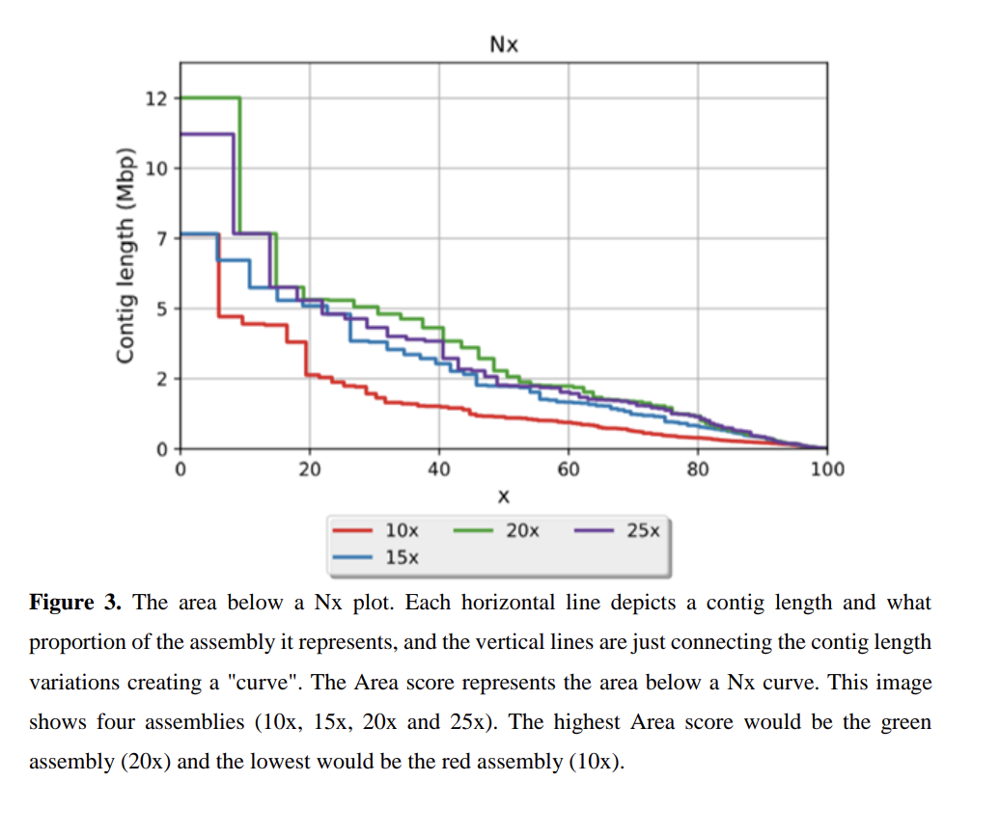
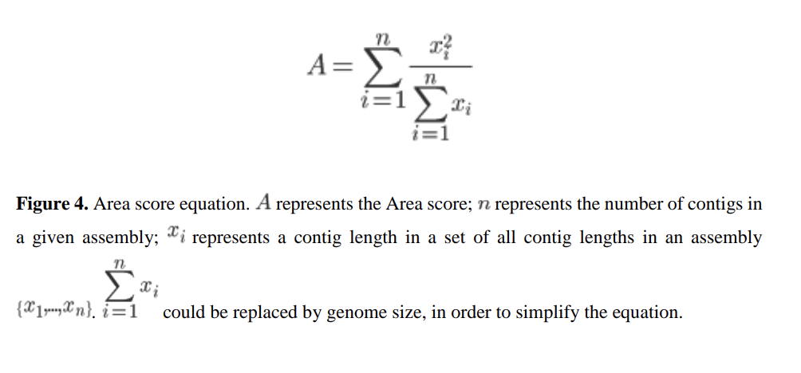

# Area Score: A Contiguity Metric Based on the Area Under the Nx Curve

This repository describes a contiguity metric for genome assemblies based on the **area under the Nx curve** (“Area score”).

It was proposed in my MSc dissertation (UFRJ, 2020-04-07) as a middle ground between:
- **N50** (single value, limited view), and
- the full **Nx curve** (richer view, harder to compare directly).

> “As a middle term between the N50 and the Nx curve, we suggest the use of a metric that assesses genome contiguity based on the area below a Nx plot.”

---

## Motivation

The Nx curve captures the contig length distribution across an assembly. Assemblies with **higher contiguity** maintain **longer contigs** across a larger portion of the genome, which naturally results in a **larger area under the Nx curve**.

Instead of comparing entire Nx curves visually, the **Area score** provides a single value that summarizes assembly contiguity.

> “This new metric (Area score) gives a single value that can be used to compare assemblies in a fast and easy way. The equation is represented by the equation on Figure 4, where is the number of contigs in a given assembly and represents a contig length in a set of all contig lengths in an assembly. This metric gives a number that represents assembly contiguity and can be used to make comparisons between de novo assemblies. The greater the Area score of the assembly the higher is the contiguity.”

---

## Figures (from dissertation)

**Figure 3 — Area under an Nx plot**

**Figure 4 — Area score equation**

---

### Independent convergence with Heng Li

After presenting this metric in my MSc work (April 2020), I later noticed that **Heng Li** independently posted a related formulation/idea regarding a new assembly contiguity metrics:

- Heng Li blog post (2020-04-08): https://lh3.github.io/2020/04/08/a-new-metric-on-assembly-contiguity

This independent convergence reinforces the relevance of moving beyond single-point metrics like N50 and toward measures that reflect the full contig length distribution.
